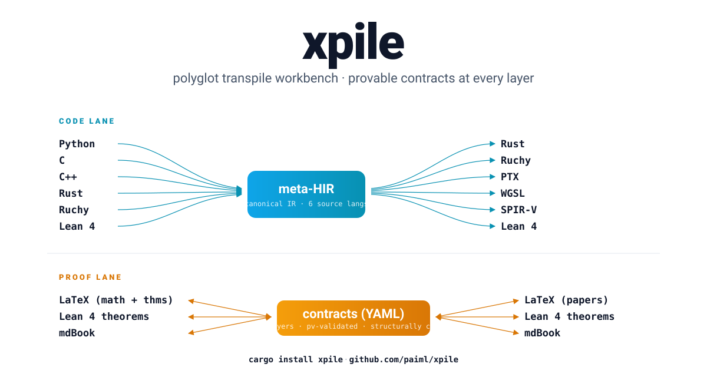

<p align="center">
  
</p>

# xpile

[](https://github.com/paiml/xpile/actions/workflows/ci.yml)
[](https://crates.io/crates/xpile)
[](#license)

**A polyglot transpile workbench with provable contracts at every layer.** Seven language frontends (Python, C, C++, Rust, Ruchy, Lean 4, Shell) share one canonical meta-HIR and dispatch through seven backends (Rust, Ruchy, PTX, WGSL, SPIR-V, Lean 4, Shell), all alongside a **proof lane** that round-trips between LaTeX, Lean 4 theorems, and mdBook through a shared YAML contract substrate. Built to solve **hybrid transpilation** — single artifacts that cross language boundaries (CPython + C extensions, Python + CUDA kernels, Python + shell scripts) — which separate per-language repos cannot.

## Status — v0.1.0

**It transpiles, semantic round-trip verified in CI.** A non-trivial recursive Python function transpiles to Rust that compiles _and computes the right values_:

```python
# factorial.py
def factorial(n: int) -> int:
    return 1 if n <= 1 else n * factorial(n - 1)
```

```bash
$ xpile transpile factorial.py
// xpile-generated from Python module factorial

pub fn factorial(n: i64) -> i64 {
    if (n <= 1i64) { 1i64 } else {
        (n).checked_mul(factorial(
            (n).checked_sub(1i64).expect("xpile: i64 subtraction overflow; bigint promotion (contract C-PY-INT-ARITH slow path) not yet implemented")
        )).expect("xpile: i64 multiplication overflow; bigint promotion (contract C-PY-INT-ARITH slow path) not yet implemented")
    }
}
```

Note the `.checked_*().expect(...)` wrappers — every arithmetic op enforces the Layer-1 contract [`py-int-arith-v1.yaml`](contracts/py-int-arith-v1.yaml): i64 overflow panics with a pointer to the unimplemented bigint slow path instead of silently wrapping. (Lean's `Int` is unbounded, so the same contract is satisfied by construction.)

CI runs `rustc -O` on the output and asserts `factorial(10) == 3628800` — the test is `factorial_emitted_rust_computes_correct_values`.

Same source, three different targets:

```bash
$ xpile transpile factorial.py --target ruchy
fun factorial(n: i64) -> i64 {
    if (n <= 1i64) { 1i64 } else {
        (n).checked_mul(factorial((n).checked_sub(1i64).expect("..."))).expect("...")
    }
}

$ xpile transpile factorial.py --target lean
def factorial (n : Int) : Int :=
  if (n <= (1: Int)) then (1: Int) else (n * (factorial (n - (1: Int))))
```

**By the numbers (live, not aspirational):**

- 27 workspace crates · all compile clean (`cargo check --workspace`)
- 12 contracts · `pv lint` PASS with **0 errors and 0 warnings** (full-clean substrate since PMAT-138)
- **100% QUORUM + UNIVERSAL 5-TIER + UNIVERSAL Diamond depth-3..13 across all 12 contracts — Diamond CI gate enforced** — every contract has paired Lean refinement theorem + Kani BMC harness; **638 stratum-vote artifacts** (285 Semantic + 53 Symbolic + 15 Runtime + 285 Extrinsic) across all 5 taxonomy layers. 42/42 equations at Silver; 12/12 contracts at Gold/Platinum; **eleven UNIVERSAL Diamond milestones** depth-3..13 (PMAT-336..442) with **171 wired Diamond theorems** across 12 contracts; deepest contracts at depth-21 (PyIntArith L1) and depth-20 (CompileRustToPtxMma L5). Thirteen recurring algebraic templates discovered: structure-extensionality (32+ contracts), enum completeness, Gold-tier subtype-ext, tier-projection homomorphism, canonical identity, Bronze↔Silver round-trip. Diamond coverage CI-enforced via `diamond_coverage.rs` (22 integration tests, depth-1..13 UNIVERSAL gates) — regressions fail builds. Reporter: `xpile diamond --json`
- **297 workspace tests** · 11+ Python fixtures runtime-verified via `rustc -O` + `assert_eq!` (canonical list in `CHANGELOG.md` §"Python subset"); plus 54 bashrs-frontend tests covering POSIX shell idioms; 22 `diamond_coverage.rs` integration tests gate depth-1..13 UNIVERSAL invariants
- **`pmat tdg .` score 95.1 / 100 (Grade A-)** — meets the originally-planned XPILE-CI-PMAT-TDG-001 ≥ A- threshold without explicit CI enforcement (slight dip from 95.7 reflects the +600 lines of Diamond-program documentation; still solidly A-)
- Python subset shipped: see [`CHANGELOG.md`](CHANGELOG.md) §"Python subset (live, runtime-verified)" — typed `def`, multi-statement bodies, all binary + unary ops, ternary, if/else, elif chains, function calls including self-recursion (canonical source — this README intentionally does not duplicate the list to avoid the staleness it kept accumulating)
- **Four real backends**: Rust (`pub fn`, Python-floor semantics via `checked_div_euclid` / `checked_rem_euclid`, all arithmetic checked for the `C-PY-INT-ARITH` contract), Ruchy (`fun ... -> T`, same overflow semantics — compiles to Rust), Lean 4 (`def`, `Int.fdiv` / `Int.fmod`; `Int` is unbounded so the contract holds by construction), bashrs (POSIX shell — see [`sub/bashrs-merger.md`](docs/specifications/sub/bashrs-merger.md))
- CI: `gate` + `kani` + `workspace-test` all run on every PR; `gate` is the load-bearing required status check (org-level ruleset rule); `kani` + `workspace-test` are not yet required but in practice green on every merged PR. Branch protection: `non_fast_forward` + PR required + `gate` status check (`gh api repos/paiml/xpile/rules/branches/main`).
- Latest tag: **`v0.1.499`** — `continue` inside a `for i in range(n)` loop now compiles (a ubiquitous idiom that was rejected): the range desugars to a `while`+counter, and a bare `continue` would skip the tail counter-increment (infinite loop); each such `continue` is now rewritten to `{ counter += step; continue }`, with nested-loop continues keeping their own counter. Recent: v0.1.498 an N-arity (≥3) tuple `for`-target (`for a, b, c in triples`) desugars to a tuple-unpack; v0.1.497 `d[k].pop()` mutates the stored list in place (was a clone — silent-wrong); v0.1.496 a list/str repeat with a bool count (`[x] * b`) coerces the count to i64; v0.1.495 `abs()`/`round()` over a bool coerce to i64; v0.1.494 `math.sqrt`/`math.log*` of an out-of-domain arg raises a catchable `ValueError("math domain error")`; v0.1.493 `int(±inf)` raises a catchable `OverflowError` / `int(nan)` a `ValueError`; v0.1.492 a tuple literal repeated by an int literal (`(0,) * 3`) expands to a fixed-arity tuple; v0.1.491 a class defining `__gt__`/`__ge__`/`__le__` without `__lt__` gets a synthesized `PartialOrd` (driving all of `<`/`>`/`<=`/`>=`); v0.1.490 `abs(obj)`/`int(obj)`/`float(obj)` over a class defining `__abs__`/`__int__`/`__float__` dispatch to the dunder; v0.1.489 a typed `except` is an allowlist (catches only its own listed types, re-raises the rest — so a `RuntimeError` propagates past `except ValueError`, and `except RuntimeError` now catches the dict-size-change error); v0.1.488 a failed `assert` raises a catchable `AssertionError`; v0.1.487 a bool key in a `dict[int, V]` literal is coerced to i64; v0.1.486 a non-None value to an Optional dataclass field is Some-wrapped; v0.1.485 arith/bitwise ops (`//`/`%`/`**`/`<<`/`&`/…) dispatch to user dunders; v0.1.484 a list/str/dict loop variable leaks to the enclosing scope; v0.1.483 a `math.*` builtin coerces an int arg to f64; v0.1.478 `repr()` escapes control chars as `\xNN`; v0.1.476 a custom `__str__` drives `Display`; v0.1.471 the 7-method dunder-dispatch cluster completed; v0.1.445 int↔float comparison is exact above 2^53. **Full per-tag history: see [CHANGELOG.md](CHANGELOG.md).** A sustained run of correctness fixes comes from multi-pass adversarial differential python3-vs-rustc hunts (HUNT-V1..V17, ~900 probes).
- Published on crates.io: [`xpile 0.1.37`](https://crates.io/crates/xpile) (`cargo install xpile`) — the full v0.1.14→v0.1.37 line shipped in the 2026-06-12 Friday batch (all 27 workspace crates). Per the release cadence, crates.io publishes **once per week on Fridays**; GitHub tags ship per slice — so the crates.io line catches up to the latest tag each Friday (next window 2026-06-19, which will pick up v0.1.38+).

### Contract substrate at QUORUM

The ruchy 5.0 §14.4 N-of-M oracle quorum rule requires ≥1 vote in ≥3 strata
(Semantic / Symbolic / Runtime / Extrinsic) for a contract to be considered
discharged. As of v0.1.0, every contract clears this bar:

```text
$ xpile quorum
  ... (12 contracts, all at QUORUM)
  totals: 12 QUORUM, 0 PARTIAL, 0 UNVERIFIED (12 contracts total)
```

**285 Semantic + 53 Symbolic + 15 Runtime + 285 Extrinsic = 638 stratum-vote artifacts** across all 5 layers of the contract taxonomy, via [`contracts/lean/*.lean`](contracts/lean/) and [`contracts/kani/*.rs`](contracts/kani/). **42/42 equations at Silver** + **12/12 contracts at Gold/Platinum** + **eleven UNIVERSAL Diamond milestones depth-3..13** (PMAT-336..442) totalling **171 wired Diamond theorems**; deepest 21 (PyIntArith L1), 20 (CompileRustToPtxMma L5). Diamond coverage is CI-enforced via the `diamond_coverage.rs` gate (22 integration tests, depth-1..13 UNIVERSAL) — regressions fail builds.
Every equation in every contract has both its own Bronze-tier Lean theorem
(`rfl` by construction) AND its own Kani symbolic harness exploring 256^4 ≈
4.3B configurations per harness. Silver/Gold/Platinum refinement is
incremental from here as concrete impl pressure arrives.

> **Canonical spec:** [`docs/specifications/xpile-spec.md`](docs/specifications/xpile-spec.md) — TOC + 25 sections, each linking to a `sub/<topic>.md`.
>
> **Adversarial audit:** [`docs/specifications/audit-design.md`](docs/specifications/audit-design.md) — Popperian falsification record (4 hypotheses).

## Two lanes, one substrate

xpile has two parallel pipelines that share the YAML contract substrate. Trait-level detail in [`sub/frontend-trait.md`](docs/specifications/sub/frontend-trait.md), [`sub/backend-trait.md`](docs/specifications/sub/backend-trait.md), [`sub/contract-frontend-trait.md`](docs/specifications/sub/contract-frontend-trait.md), [`sub/contract-backend-trait.md`](docs/specifications/sub/contract-backend-trait.md).

### Code lane (executable code)

```
Frontends                      Backends
─────────                      ─────────
Python   ─┐               ┌─→ Rust        ✅ real emission
C        ─┤               ├─→ Ruchy       ✅ real emission
Shell    ─┤               ├─→ Shell       ✅ real emission (POSIX, PMAT-037..058)
C++      ─┼→ meta-HIR ─→ ─┼─→ PTX         🚧 scaffold + Layer-5 contract (QUORUM)
Rust     ─┤               ├─→ WGSL        🚧 scaffold
Ruchy    ─┤               ├─→ SPIR-V      🚧 planned
Lean 4   ─┘               └─→ Lean 4      🚧 scaffold
```

### Proof lane (notation + proofs)

```
ContractFrontends             ContractBackends
─────────────────             ─────────────────
LaTeX       ─┐                  ┌─→ LaTeX (papers)
Lean 4 thm  ─┼─→ contracts ←──←─┼─→ Lean 4 theorems
mdBook      ─┘                  └─→ mdBook
```

Lean 4 spans both lanes. LaTeX is proof-lane-only. Citation bridge uses **format-native structured constructs** (`@[xpile_contract "..."]` attribute in Lean, `\xpileContract{...}{...}` macro in LaTeX, structured comment in mdBook) — never regex over body text. Revised post-audit; see [`sub/contract-backend-trait.md`](docs/specifications/sub/contract-backend-trait.md) §"Citation bridge".

## Quick orientation

| Question | Section |
|---|---|
| What is xpile and why does it exist? | [§1 Vision and Architecture](docs/specifications/sub/vision.md) |
| How do I add a new language? | [§17 Frontend Onboarding](docs/specifications/sub/frontend-onboarding.md) |
| Lean 4 in both lanes? | [§24 Lean 4 Bidirectional](docs/specifications/sub/lean-bidirectional.md) |
| LaTeX in the proof lane? | [§25 LaTeX Bidirectional](docs/specifications/sub/latex-bidirectional.md) |
| What is hybrid transpilation? | [§16 Hybrid Transpile Flow](docs/specifications/sub/hybrid-transpile-flow.md) |
| How does the agent loop work? | [§7 Bounded Agent Repair Loop](docs/specifications/sub/agent-loop.md) |
| How are contracts validated? | [§11 Provable Contracts (`pv`)](docs/specifications/sub/pv-integration.md) |
| What's the contract taxonomy? | [§13 Contract Taxonomy](docs/specifications/sub/contract-taxonomy.md) (5 layers × 2 lanes) |
| What are the quality gates? | [§12 `pmat`](docs/specifications/sub/pmat-integration.md) + [§18 CI Pipeline](docs/specifications/sub/ci-gates.md) |

## Contracts at v0.1.0 (12, all at QUORUM)

| Contract | `pv` kind | Layer × Lane | What it pins down | Refinements |
|---|---|---|---|---|
| `xpile-frontend-trait-v1.yaml` | pattern | 3 architectural / code | Frontend trait invariants | [Lean](contracts/lean/XpileFrontendTrait.lean) · [Kani](contracts/kani/xpile_frontend_trait.rs) |
| `xpile-backend-trait-v1.yaml` | pattern | 3 / code | Backend trait + structural compile-contract citation | [Lean](contracts/lean/XpileBackendTrait.lean) · [Kani](contracts/kani/xpile_backend_trait.rs) |
| `xpile-contract-frontend-trait-v1.yaml` | pattern | 3 / proof | ContractFrontend trait invariants | [Lean](contracts/lean/XpileContractFrontendTrait.lean) · [Kani](contracts/kani/xpile_contract_frontend_trait.rs) |
| `xpile-contract-backend-trait-v1.yaml` | pattern | 3 / proof | ContractBackend + citation bridge via structured attrs | [Lean](contracts/lean/XpileContractBackendTrait.lean) · [Kani](contracts/kani/xpile_contract_backend_trait.rs) |
| `py-int-arith-v1.yaml` | kernel | 1 semantics / code | Python `int` arithmetic with bigint promotion | [Lean](contracts/lean/PyIntArith.lean) · [Kani](contracts/kani/py_int_arith.rs) |
| `bashrs-posix-idempotence-v1.yaml` | pattern | 1 semantics / code | POSIX shell idempotence, Python↔bashrs cross-domain | [Lean](contracts/lean/Bashrs.lean) · [Kani](contracts/kani/bashrs.rs) |
| `xlate-py-list-to-vec-v1.yaml` | kernel | 2 translation / code | Python list → Rust Vec, alias-preserving | [Lean](contracts/lean/XlatePyListToVec.lean) · [Kani](contracts/kani/xlate_py_list_to_vec.rs) |
| `xlate-lean-to-rust-v1.yaml` | kernel | 2 / code | All Lean 4 constructs (def, partial, inductive, instance, axiom, ...) → Rust | [Lean](contracts/lean/XlateLeanToRust.lean) · [Kani](contracts/kani/xlate_lean_to_rust.rs) |
| `xlate-rust-fn-to-lean-thm-v1.yaml` | kernel | 2 / proof | Rust fn + contract → Lean 4 theorem with `@[xpile_contract]` attr | [Lean](contracts/lean/XlateRustFnToLeanThm.lean) · [Kani](contracts/kani/xlate_rust_fn_to_lean_thm.rs) |
| `notation-latex-math-to-equation-v1.yaml` | kernel | 2 / proof | LaTeX math + theorem envs → contract equations | [Lean](contracts/lean/Notation.lean) · [Kani](contracts/kani/notation.rs) |
| `ffi-cpython-ext-v1.yaml` | pattern | 4 hybrid / code | CPython C-extension boundary semantics | [Lean](contracts/lean/FfiCpythonExt.lean) · [Kani](contracts/kani/ffi_cpython_ext.rs) |
| `compile-rust-to-ptx-mma-v1.yaml` | pattern | **5 compile / code** | PTX emission: `mma.sync`, `cp.async` pipelining, SMEM budget | [Lean](contracts/lean/CompileRustToPtxMma.lean) · [Kani](contracts/kani/compile_rust_to_ptx_mma.rs) |

`pv lint contracts/` → PASS, **0 errors and 0 warnings**. `xpile quorum` → 12 QUORUM, 0 PARTIAL, 0 UNVERIFIED. Every equation carries domain-grounded pre/postconditions; every equation is anchored to a Lean refinement theorem; every contract declares a `qa_gate`.

## Workspace (27 crates)

```
crates/
├── xpile/                           CLI binary
├── xpile-core/                      session orchestration + default_session()
├── xpile-agent/                     bounded agent loop (from alchemize)
├── xpile-oracle/                    Oracle trait — capture & compare execution
├── xpile-llm/                       model invocation + content-addressed cache
├── xpile-mcp/                       MCP server
├── xpile-contracts/                 re-export of provable-contracts (pv)
├── xpile-meta-hir/                  canonical IR (incl. Layer-B shell variants)
├── xpile-ffi-manifest/              cross-language boundary registry
├── xpile-bigint/                    BigInt promotion lane (slow path)
│
├── xpile-frontend/                  Frontend trait (code lane)
├── xpile-backend/                   Backend trait (code lane)
├── xpile-contract-frontend/         ContractFrontend trait (proof lane)
├── xpile-contract-backend/          ContractBackend trait (proof lane)
│
├── depyler-frontend/                Python   (.py, .pyi) — REAL parser
├── decy-frontend/                   C        (.c, .h)    — scaffold
├── ruchy-frontend/                  Ruchy    (.ruchy)    — scaffold
├── bashrs-frontend/                 Shell    (.sh)       — REAL parser (POSIX subset)
│
├── xpile-rust-codegen/              Rust    — REAL emission
├── xpile-ruchy-codegen/             Ruchy   — REAL emission
├── xpile-ptx-codegen/               PTX     — scaffold + Layer-5 contract
├── xpile-wgsl-codegen/              WGSL    — scaffold
├── xpile-lean-codegen/              Lean 4  — scaffold
├── bashrs-backend/                  Shell   — REAL emission (POSIX subset)
│
├── latex-contract-frontend/         LaTeX   — scaffold
├── xpile-lean-contract-backend/     Lean theorems — scaffold (attr citation)
└── xpile-latex-contract-backend/    LaTeX papers  — scaffold (macro citation)
```

`depyler` / `decy` / `ruchy` are also exposed as workspace **aliases** so the original `cargo install depyler` / `cargo install decy` / `cargo install ruchy` consumers keep working when the merge plan in [`sub/migration.md`](docs/specifications/sub/migration.md) lands.

## CI gates (live)

Every PR runs:

| Step | Command |
|---|---|
| Formatting | `cargo fmt --all -- --check` |
| Type check | `cargo check --workspace` |
| Lint | `cargo clippy --workspace --all-targets -- -D warnings` |
| Provable contracts | `pv lint contracts/` (via `aprender-contracts-cli`) |
| Security advisories | `cargo deny check advisories` |
| Tests | `cargo test --workspace` (incl. e2e rustc round-trip and `every_kani_harness_discharges`) |
| Kani BMC | dedicated `kani` job runs `cargo kani` over all Kani harnesses in `contracts/kani/` |

Workflow: [`.github/workflows/ci.yml`](.github/workflows/ci.yml).

## Family

| Repo | Role |
|---|---|
| `paiml/xpile` (this) | Polyglot transpile workbench |
| `paiml/aprender` | ML framework; source of `aprender-contracts` (`pv`) |
| `paiml/depyler` | Python→Rust transpiler — folds into xpile per [§19](docs/specifications/sub/migration.md) |
| `paiml/decy` | C→Rust transpiler — folds in |
| `paiml/ruchy` | Modern data science language; xpile's third frontend |
| `paiml/paiml-mcp-agent-toolkit` | `pmat` |
| `pymc-labs/alchemize` | Source of the four-tool agent loop pattern |

## Install

```bash
cargo install xpile
```

Requires Rust 1.93+. All 27 workspace crates are published on crates.io
at v0.1.0. For source-based installs and the optional dev tooling (`pv`,
`pmat`, `cargo kani`), see the
[book's Installation chapter](https://paiml.github.io/xpile/installation.html).

## Usage

```bash
$ xpile info                                  # list registered frontends/backends
$ xpile transpile factorial.py                # Python → Rust (default)
$ xpile transpile factorial.py --target ruchy # Python → Ruchy
$ xpile transpile factorial.py --target lean  # Python → Lean 4
$ xpile transpile script.sh --target shell    # POSIX shell round-trip
$ xpile diamond --contracts-dir ./contracts   # Diamond-tier coverage report
$ xpile quorum  --contracts-dir ./contracts   # 4-stratum quorum report
```

End-to-end tutorials and the full CLI reference live in the book:
**<https://paiml.github.io/xpile/>**.

## License

MIT OR Apache-2.0. See `LICENSE-MIT` and `LICENSE-APACHE`.
